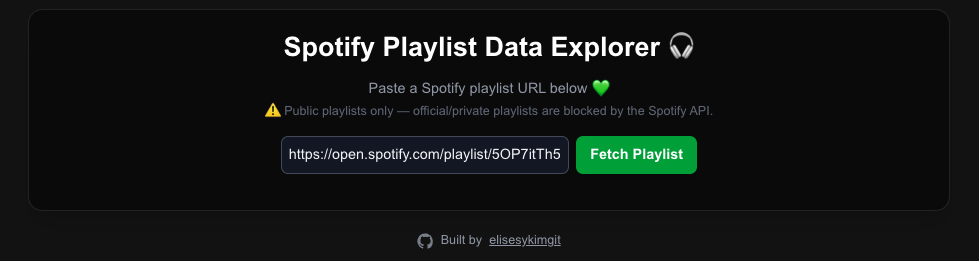
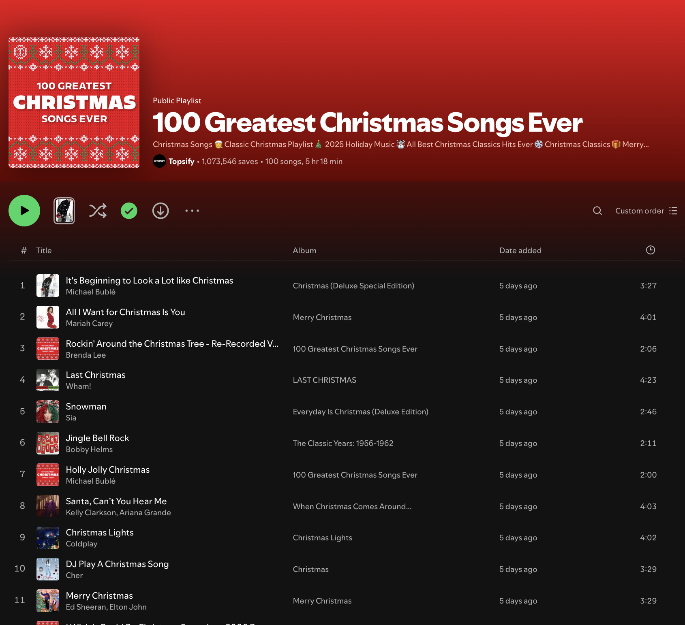
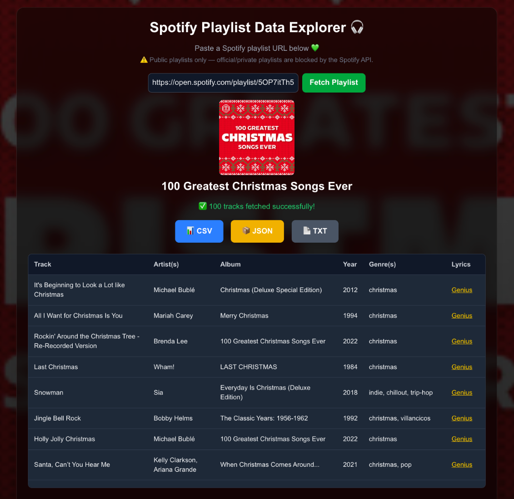
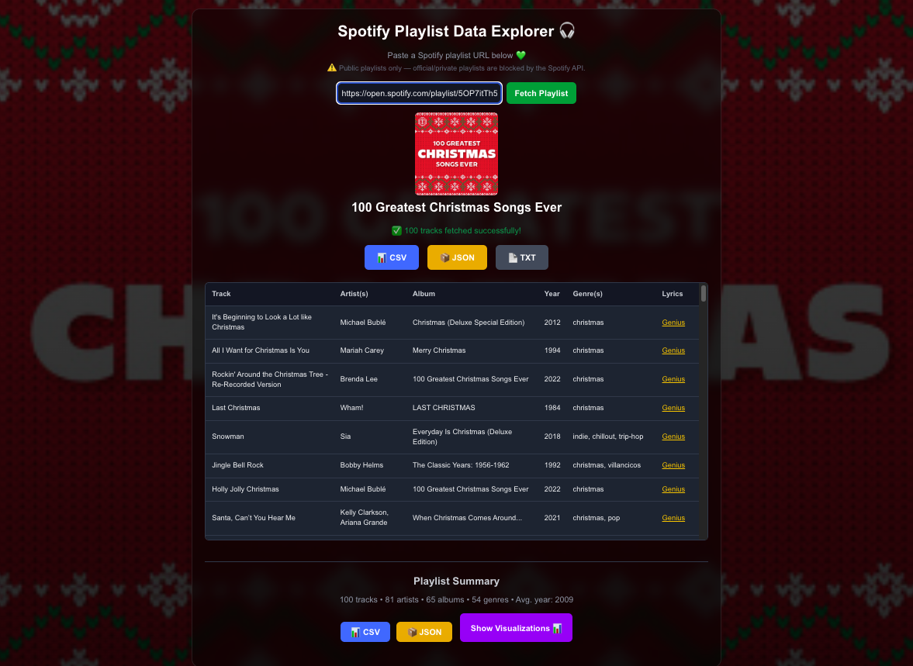
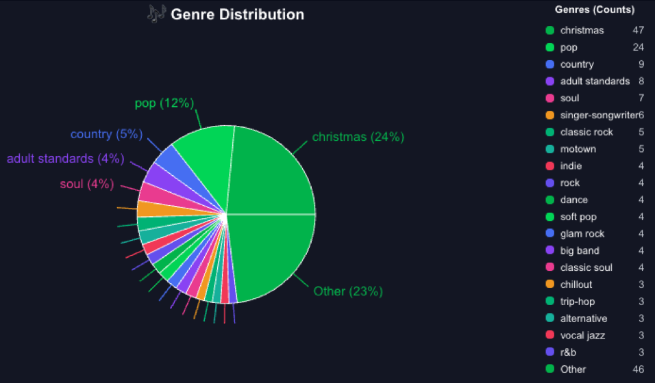
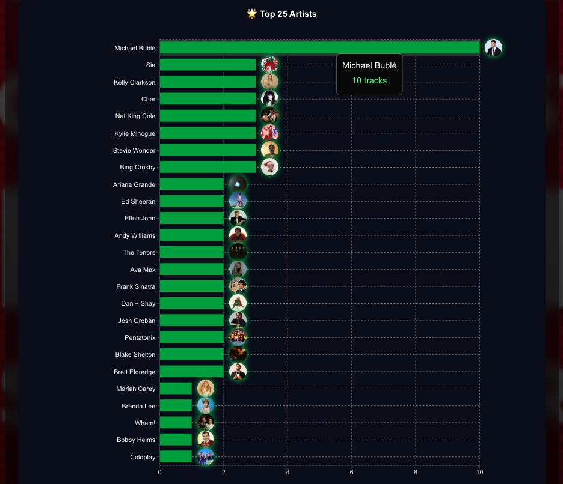
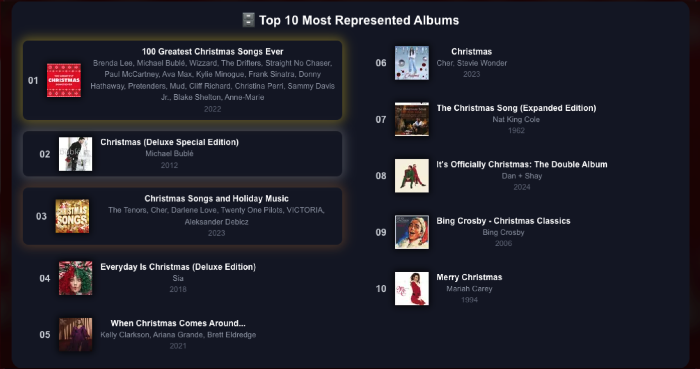
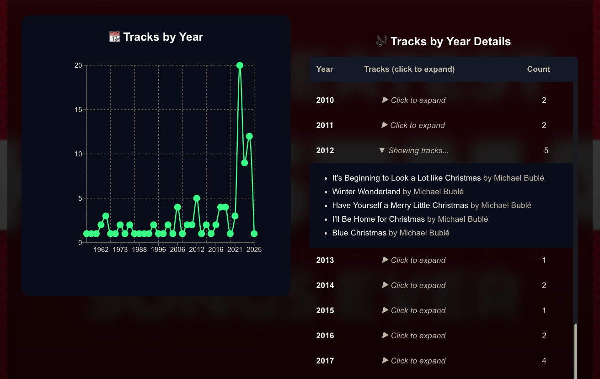

# 🎧 Spotify Playlist Data Explorer

Fetch detailed track, artist, genre, and lyric-source data from any *public* Spotify playlist — with built-in visualizations and export tools.


**Live App:** [Spotify Playlist Data Explorer](https://spotify-playlist-data-explorer.vercel.app/)

**API:** `/api/playlist/[id]` (serverless Next.js route)

---

## Overview

**Spotify Playlist Data Explorer** is a lightweight web tool that allows you to extract **rich metadata** from public user-made Spotify playlists, including:

* Track name
* Artists 
* Album & year
* Artist genres 
* Album & artist images
* Lyrics links (Genius API when available, Google fallback)
* CSV / JSON / TXT export options
* Genre charts, artist charts, album gallery
* Year distribution & expandable year-group view

This tool works **without user authentication**, utilizing a backend serverless function that fetches playlist data using the app’s client credentials Spotify token.

> ⚠️ **Note:** Due to Spotify API restrictions, playlists **must be public** and **user-made**. Official Spotify editorial playlists and private playlists cannot be accessed.

---

## 📸 **Example Walkthrough: Real Playlist Analysis**

Before the full feature breakdown, the example below walks through the app’s core layout and features as they appear during actual use.

> The images below provide a step-by-step visual walkthrough of the app in action.

### 🎄 Example: “100 Greatest Christmas Songs Ever” Playlist Breakdown

Before diving into the UI and visualizations, here’s the first screen users see.

Simply paste any **public Spotify playlist URL** to begin analysis:



### ▶️ Example Playlist Used in the Demo

For the screenshots below, the demo uses the public Spotify playlist:

**“[100 Greatest Christmas Songs Ever](https://open.spotify.com/playlist/5OP7itTh52BMfZS1DJrdlv?si=d2d29f45f4ef476a)”** (1M+ saves) 

by **Topsify**



> This playlist was chosen because it contains a diverse mix of artists, release years, and genres, making it a good demonstration dataset.

---

## 🖼️ **App Overview**

Below are the core parts of the UI that users interact with when fetching playlist data.

### 🟢 **1. Fetch Results Table**

After entering a playlist URL, the app returns a structured dataset containing:

* Track name
* Artists
* Album
* Release year
* Auto-detected genre(s)
* Lyric source (via Genius)




### 🟢 **2. Full UI Overview (Zoomed Out)**

This view shows:

* **Playlist metadata** (cover image, title)
* A **themed background** auto-generated from the playlist cover art
* Export buttons (**CSV**, **JSON**, **TXT**)
* Complete track table
* **Playlist Summary**: tracks, artists, albums, genres, avg. release year
* Downloadable playlist statistics (CSV, JSON)
* The **“Show Visualizations”** toggle that opens the charts section



---

## 📊 **Visualizations**

### 🟢 **3. Genre Distribution Pie Chart**

Displays the genre makeup of the playlist, showing:

* % share of top genres
* Full genre count list
* Grouped “Other” category for long tails




### 🟢 **4. Top 25 Artists**

Ranks the most frequent artists in the playlist:

* Horizontal bar chart
* Artist profile images
* Hover tooltips showing **exact track count**




### 🟢 **5. Top 10 Albums Visualization**

Shows the **10 most represented albums** in the playlist:

* Top 3 albums highlighted with **gold/silver/bronze glow effects**
* Album cover art and release year
* Artists featured on each album




### 🟢 **6. Tracks by Year + Year Details**

A two-part visualization:

**Left:**

* Tracks per release year (scatter + line)
* Highlights peaks in release-year activity

**Right:**

* Collapsible breakdown
* Expands each year to display all tracks from that year inline



---

These visualizations give users a clear, interactive breakdown of any public Spotify playlist — from genres and artists to release-year trends and album representation.

---

## 🚀 Detailed Feature Breakdown

### ✔️ Playlist Metadata

* Playlist name
* Cover image
* Description

### ✔️ Track Metadata

For each track:

* Track title
* Artists
* Album name
* Release year
* Artist genres (top 3 from Spotify, or top 3 filtered Last.fm tags when Spotify provides none)
* Lyrics link (Genius API or Google fallback)
* Album image
* Artist image

### ✔️ Lyrics URL Matching

The backend:

1. **Normalizes track titles** (removes qualifiers like "Remaster", "Edit", "Live", etc.)
2. Generates multiple candidate titles
3. Queries the **Genius API** (when `GENIUS_ACCESS_TOKEN` is available)
4. Scores each match using:

   * Jaccard token similarity
   * Artist match weight
5. Accepts a match if the score is greater than 0.85

If no Genius match is found, it falls back to a **Google search** targeting sites like Genius, AZLyrics, Musixmatch, and Lyrics.com.

### ✔️ Spotify Track Fetching (with Pagination)

The API fetches playlist tracks using:

* Paginated 100-item requests
* `?limit=` query parameter
* Maximum of 1000 tracks per request
* Efficient batching and concurrency limiting (default: 5)

### ✔️ Artist Genre & Image Fetching

For each track:

* The primary artist is fetched from Spotify
* Genres are extracted and normalized
* The first available artist image is used
* A caching layer prevents redundant Spotify calls

If Spotify returns no genres for an artist, the API automatically queries the Last.fm API and retrieves the artist’s top tags.  
Non-genre tags (such as “seen live”, “favorites”, or “bardfm”) are filtered out, and the top 3 valid genres are used.  
This ensures accurate genre distribution even for artists missing Spotify genre data.


### ✔️ Export Options

Client-side export options:

* **CSV**
* **JSON**
* **TXT**

### ✔️ Data Visualizations

The UI includes:

* Genre distribution pie chart
* Top artists bar chart
* Album gallery (most frequent albums with cover images)
* Tracks-by-year line chart
* Expandable table of tracks grouped by year

---

## 🏗️ Tech Stack

### Frontend

* Next.js (App Router)
* React
* Recharts (for data visualizations)
* Tailwind CSS

### Backend (API Routes)

* Next.js Route Handlers
* Spotify Web API
* Genius API (optional)
* Google search fallback
* Last.fm API (optional fallback for missing Spotify genres)

---

## 📁 Project Structure

```
app/                            # Main app logic (UI, API routes)
│── api/
│   └── playlist/
│       ├── route.ts            # Playlist API (generic entry point)
│       └── [id]/route.ts       # Fetch + normalize a playlist by Spotify ID
├── page.tsx                    # Main page: input form + rendered results
├── providers.tsx               # React/Next.js context providers
├── globals.css                 # Global Tailwind/CSS styles

components/                     # Reusable UI components
│   ├── charts/                 # Data visualizations (Recharts)
│   ├── PlaylistTable.tsx       # Track metadata table
│   ├── DownloadButton.tsx      # Export clean dataset (CSV/JSON/TXT)
│   └── DownloadStatsButton.tsx # Export playlist summary statistics

public/                         # Static assets (images, placeholders)
types/                          # Shared TypeScript definitions
```

---

## 🔐 Environment Variables

Create a `.env.local` file and add the following:

```env
SPOTIFY_CLIENT_ID=your_id
SPOTIFY_CLIENT_SECRET=your_secret

# Optional but recommended        
SPOTIFY_REFRESH_TOKEN=your_refresh_token  # recommended for stable artist images / fewer 401s
GENIUS_ACCESS_TOKEN=your_token
LASTFM_API_KEY=your_lastfm_api_key  # Optional – used to fetch artist genres when Spotify returns none
PLAYLIST_FETCH_CONCURRENCY=5        # Optional, limits simultaneous track fetches

```

### Description of Each Variable

| Variable                     | Required | Description                                                  |
| ---------------------------- | -------- | ------------------------------------------------------------ |
| `SPOTIFY_CLIENT_ID`          | ✅        | Required for retrieving playlist data via Client Credentials |
| `SPOTIFY_CLIENT_SECRET`      | ✅        | Used to obtain Spotify access tokens                         |
| `SPOTIFY_REFRESH_TOKEN`      | Optional | Enables automatic token refreshing for more stable artist images (fewer 401/403 errors) |
| `GENIUS_ACCESS_TOKEN`        | Optional | If set, the API can return **correct Genius lyrics URLs**    |
| `LASTFM_API_KEY`             | Optional | Fetches fallback artist genres when Spotify provides none |
| `PLAYLIST_FETCH_CONCURRENCY` | Optional | Limits simultaneous track fetches                            |

> **Note:** The app works without `SPOTIFY_REFRESH_TOKEN`, but Spotify may occasionally return empty artist images or intermittent `401 Unauthorized` responses for `/v1/artists/{id}` when rate-limited. Supplying a refresh token eliminates nearly all of these issues.

---

## 🔌 API Endpoints

### **GET /api/playlist/:id**

Fetches playlist metadata and all track details.

Example response:

```json
{
  "name": "My Playlist",
  "image": "https://mosaic.scdn.co/...",
  "description": "My favorite playlist",
  "tracks": [
    {
      "track": "Sweet Child O' Mine",
      "artists": ["Guns N' Roses"],
      "artistJoined": "Guns N' Roses",
      "artistIds": ["3qm84nBOXUEQ2vnTfUTTFC"],
      "album": "Appetite For Destruction",
      "albumId": "28yHV3Gdg30AiB8h8em1eW",
      "year": "1987",
      "genre": "rock, glam metal, hard rock",
      "lyricsUrl": "https://genius.com/Guns-n-roses-sweet-child-o-mine-lyrics",
      "lyricsSource": "genius",
      "image": "https://i.scdn.co/image/...",
      "albumImage": "https://i.scdn.co/image/...",
      "artistImage": "https://i.scdn.co/image/...",
      "artistImages": {
              "3qm84nBOXUEQ2vnTfUTTFC": "https://i.scdn.co/image/..."
      }
    }
  ]
}
```

### Query Options

```
/api/playlist/PLAYLIST_ID?limit=500
```

Limit defaults:

* Default: 750 tracks
* Maximum: 1000 tracks

---

## 🛑 Limitations

### Due to Spotify’s API:

* **Only public playlists** are accessible
* **Official Spotify editorial playlists** are blocked (returns 401/403)
* Private playlists require OAuth authentication (not supported here)
* Some artists have no genres on Spotify; in these cases, Last.fm data is used to fill the gaps
* For complete stability (especially artist images), using a Spotify refresh token is recommended — otherwise some artist endpoints may return empty data or intermittent 401s

### Lyrics:

* Genius results are **not guaranteed**
* Google search fallback returns a link, not lyrics text

---

## Development

Install dependencies:

```bash
npm install
```

Run locally:

```bash
npm run dev
```

Deploy to Vercel:

```bash
vercel
```

---

### 👩‍💻 Author

Built by **elisesykimgit**

> Full-stack system designed and implemented end-to-end for this project.

GitHub: [https://github.com/elisesykimgit](https://github.com/elisesykimgit)

---

⭐ If this project helps you, please star the repo!

